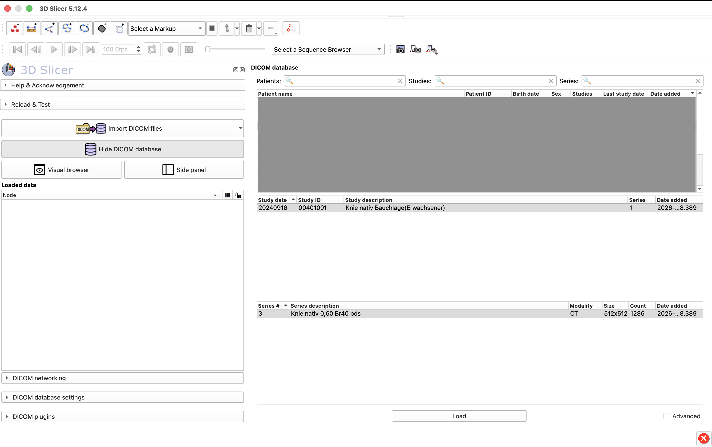
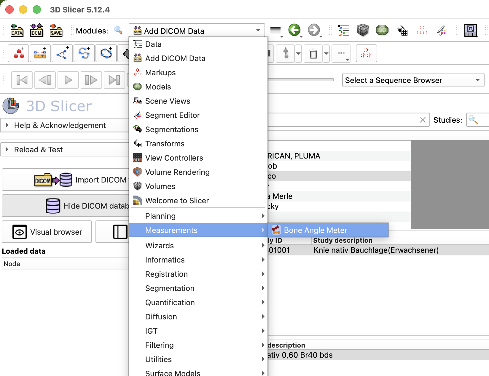
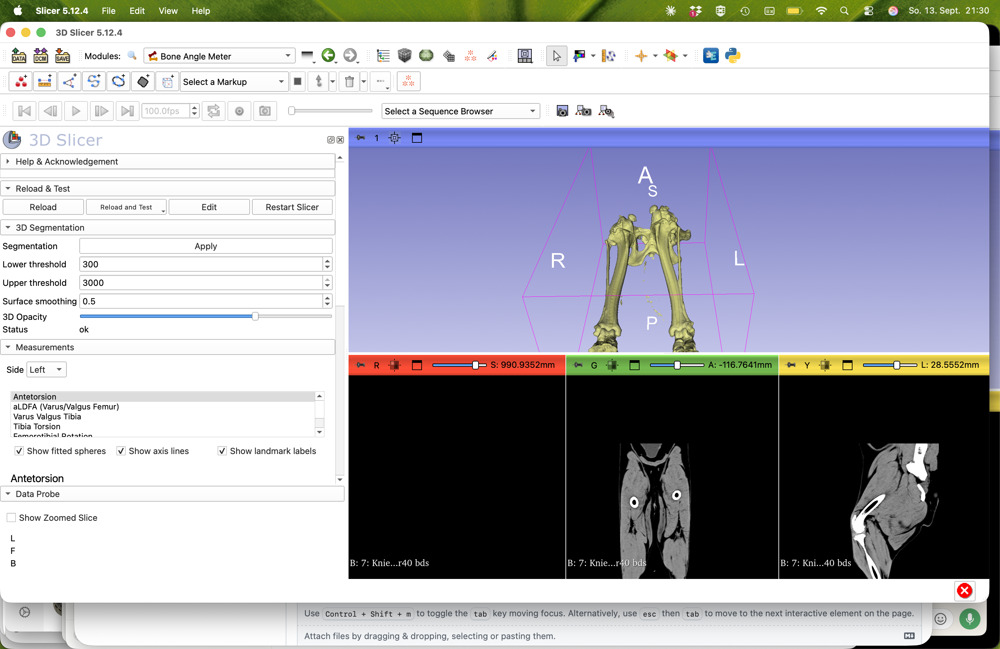

# BoneAngleMeter

> **Note:** This is a modified fork of the original BoneAngleMeter project, with
> additional measurements, bug fixes, and interface changes. See
> [CHANGELOG.md](CHANGELOG.md) for full details. The original description and
> credit below remain accurate for the base project.

This repository contains the code developed during Juliette Burg Personnaz' dissertation at *CTK, LMU Munich*. 
This 3D-Slicer plugin can be used to measure bone-angles in CT-images. The currently supported measurements are only valid for the canine hind-limbs. 

## Usage
1.	Select the "DCM" button on the upper-left and when select the button "Import Dicom files" and choose the Dicom files you want to work with

    
2.	Choose "Measurements --> Bone angle meter" on the workstation. 

    

3.	Select the button "Apply" to generate the 3D bone model from the CT scan. The threshold can be adapted by changing the **Lower threshold** and **Upper threshold** values and reselecting "Apply". The **Surface smoothing** and **3D Opacity** sliders adjust the appearance of the model — lowering the opacity is useful for seeing landmarks placed inside the bone.
    
  
4.	Open the **Measurements** section in the sidebar (click its header to expand it), and use the **Side** dropdown to choose the left or right hind limb.
   
5.	Choose the measurement you want to start with from the list (aLDFA, Antetorsion, Tibia Torsion, Varus Valgus Tibia, Femorotibial Rotation, Tibiotalar Rotation, Tibial Metatarsal Angle).
	
6.	Choose the first landmark. A description and reference image show how to set the point (click the image to view it enlarged). Set the point on one of the CT image windows or the 3D view. If you're not satisfied with a placed point, click again to move it, or select "Delete" to remove just that landmark and place it again from scratch. For the femoral head and condyles, place the center point and then adjust the **Sphere radius** field until the displayed sphere matches the bone surface.

8.	Use "Show fitted spheres", "Show axis lines", and "Show landmark labels" to toggle what's shown in the 3D view while you work.
9.	Once every landmark for the measurement is placed, the angle value and its interpretation (e.g. Varus/Valgus, Outward/Inward rotation) appear in green, along with the compared axes.
10.	To save the landmarks, select "Export"; to save the measurement results, select "Export Results" — both at the bottom of the panel.
11.	To rework the same landmarks later, select "Import" and choose the saved CSV file. "Delete All" clears every landmark for the current side.


## Installation instructions

1. Make sure that you have installed *3D Slicer*. If not, please download it [here](https://download.slicer.org/) and install it.
2. Download the latest release of the *BoneAngleMeter* module from [here](https://github.com/jburgp/BoneAngleMeter_public/releases). Select ```.zip``` file under "Assets*.
3. Extract the ```.zip``` file to a folder of your choice, e.g. to ```Documents```. 
4. Open *3D Slicer*
5. In the drop-down menu "Modules", go to "Developer Tools --> Extension Wizard"
6. Click "Select Extension" in the left sidebar under "Extension Tools"
7. Select the folder where you unpacked the ```.zip``` file to.
8. Uncheck the "Enable developer tools" checkbox and click ok
9. You should now find the *BoneAngleMeter* module in the "Modules" drop-down menu under "Measurements --> Bone Angle Meter"
